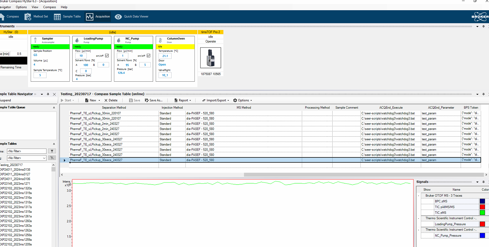
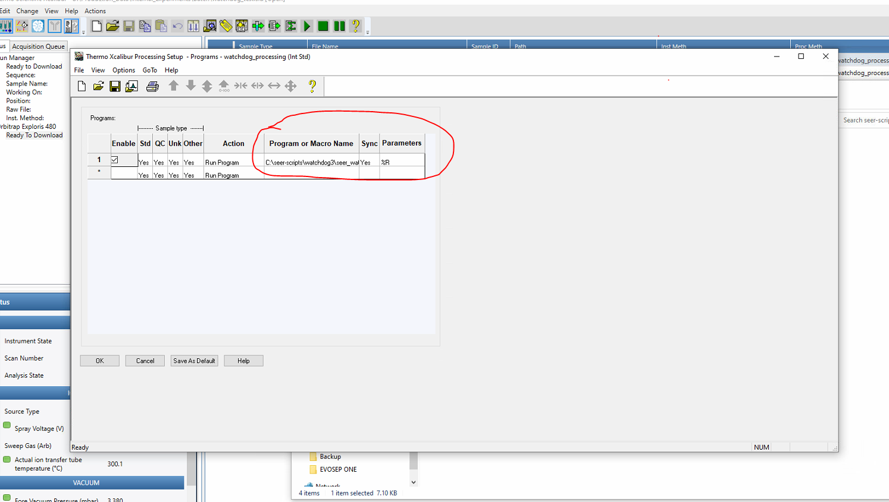
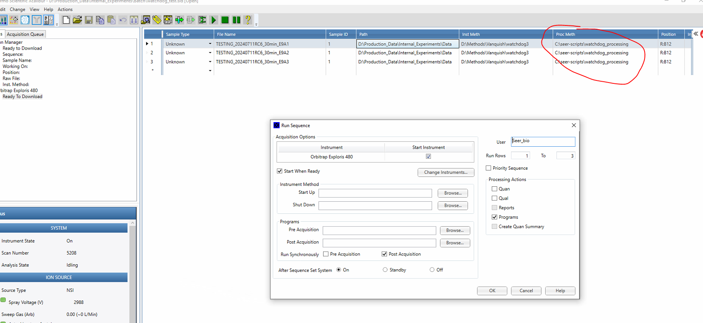

# Data Transfer Utility

## Overview

This utility script is designed to conditionally zip directories and transfer data either to AWS S3 or to a local directory, depending on the specified instrument type and destination. It supports instruments of types Bruker, Thermo, and Sciex. For Bruker and Sciex, the utility zips the specified directories (expecting `.d` and `.wiff` files respectively) before transfer. For Thermo, the `.raw` files are transferred without zipping. The script also verifies file integrity, logs actions locally, and to AWS CloudWatch.

## Requirements

- Python 3.x
- Boto3 Argparse
- AWS CLI (configured with access key and secret access key)
- Access to an AWS S3 bucket (for S3 uploads)
- 
## Setting Up Python with Miniconda

This guide provides instructions for setting up a Python development environment using Miniconda. It is important to note that the Python executable (`python.exe`) is located in the Miniconda base directory, not in the `Scripts` folder, which is a common point of confusion.

## Prerequisites

Ensure Miniconda is installed on your system. If not, download and install it from the [Miniconda website](https://docs.conda.io/en/latest/miniconda.html).

## Step 1: Verify Python Installation

Locate the Python executable in your Miniconda installation directory. This is typically found at:
```C:\Users\YourUsername\Miniconda3\python.exe```

## Step 2: Configure Environment Variables

To easily access Python and Conda commands from any command prompt, you need to add Miniconda to your PATH. Here's how:

1. **Open Environment Variables:**
   - Right-click the **Start** button and select **System**.
   - Click on **About**, then on **Advanced system settings**.
   - Click on **Environment Variables** in the System Properties window.

2. **Edit PATH Variable:**
   - Under "System variables" or "User variables", find and select the **Path** variable and click **Edit**.
   - Click **New** and add the Miniconda directory:
     ```
     C:\Users\YourUsername\Miniconda3
     ```
   - Click **New** again and add the `Scripts` directory to access Conda scripts:
     ```
     C:\Users\YourUsername\Miniconda3\Scripts
     ```
   - Click **OK** to save changes and exit all dialogs.

## Step 3: Restart Command Prompt

Restart any open command prompts to apply the updated PATH settings. Test your configuration by running:

```python --version```

```conda --version```


## Seer-Watchdog Setup

1. Ensure Python 3.x is installed on your system.
2. Install Boto3 and ArgParse by running `pip install boto3 argparse`.
3. Configure AWS CLI with your AWS credentials (`aws_access_key_id` and `aws_secret_access_key`) by running `aws configure`.


### Installation

Place the ```seer_watchdog.py``` and ```seer_watchdog.bat``` scripts in the following directory:
```C:/seer-scripts/watchdog3```

## Usage

### Basic Command Structure

```shell
python seer_watchdog.py --source <SOURCE> --dest <DESTINATION_PATH> --instrument <INSTRUMENT_TYPE> --destination <DESTINATION_TYPE> [--bucket <BUCKET_NAME>] [--aws_access_key_id <ACCESS_KEY>] [--aws_secret_access_key <SECRET_KEY>] [--log_group <LOG_GROUP>] [--log_stream <LOG_STREAM>]

usage: seer_watchdog.py [-h] [--aws_access_key_id AWS_ACCESS_KEY_ID]
                        [--aws_secret_access_key AWS_SECRET_ACCESS_KEY]
                        --source SOURCE [--bucket BUCKET] [--dest DEST]
                        --instrument {Bruker,Thermo,Sciex} --destination
                        {S3,Directory} [--log_group LOG_GROUP]
                        [--log_stream LOG_STREAM]

Zip Bruker and Sciex *.wiff and *.d directories (or transfer Thermo *.raw),
upload it to AWS S3 or copy it to a local directory based on the instrument
type and destination, verify integrity, and log both locally and to
CloudWatch.

optional arguments:
  -h, --help            show this help message and exit
  --aws_access_key_id AWS_ACCESS_KEY_ID
                        AWS access key ID (required only if destination is S3)
  --aws_secret_access_key AWS_SECRET_ACCESS_KEY
                        AWS secret access key (required only if destination is S3)
  --source SOURCE       Source directory or file to be uploaded/copied
  --bucket BUCKET       Destination S3 bucket name (required only if destination is S3)
  --dest DEST           Destination directory for file copy (required only if destination is Directory)
  --instrument {Bruker,Thermo,Sciex} Type of instrument
  --destination {S3,Directory} Destination type: Upload to S3 or copy to a local directory
  --log_group LOG_GROUP CloudWatch Logs group name (required only if destination is S3)
  --log_stream LOG_STREAM CloudWatch Logs stream name (required only if destination is S3)
  --install-dir Installation directory path (required)
```


### Bruker MS System

- Create column in MS method with  ACQEnd_Execute and ACQEnd_Parameter columns
- Provide path to windows batch script



### Example Windows Batch Script

```
@echo off
set param1=%1
set sourceDir=%2

:: Check if the source directory argument is provided
if "%~2" == "" (
    echo You must provide the source directory as the second argument.
    exit /B -1
)

set watchdog_batch_script_log=E:/git/seer-watchdog/script_logs
echo %DATE% %TIME% - param1 is %param1% >> %watchdog_batch_script_log%
echo %DATE% %TIME% - Invoked with directory: %sourceDir% >> %watchdog_batch_script_log%

:: Log the execution of seer_watchdog.py
echo %DATE% %TIME% - Executing seer_watchdog.py with directory: %sourceDir% >> %watchdog_batch_script_log%

:: Execute seer_watchdog.py and log output
python E:\git\seer-watchdog\seer_watchdog.py --aws_access_key_id "" --aws_secret_access_key "" --aws-region us-west-2 --source "%sourceDir%" --bucket seer-de-test-bucket --instrument Bruker --destination S3 --log_group ms_data_log_group --log_stream ms_data_log_stream >> %watchdog_batch_script_log% 2>&1

:: Check if the Python script executed successfully.
if %ERRORLEVEL% neq 0 (
    echo Error occurred during script execution >> %watchdog_batch_script_log%
    exit /B %ERRORLEVEL%
)

echo %DATE% %TIME% - Zipped and uploaded: %sourceDir% >> %watchdog_batch_script_log%

echo Script executed successfully >> %watchdog_batch_script_log%
exit /B 0
```

### Example batch script
```
seer_watchdog.bat dummy_parameter1 path-to-file\TESTING_202400326RC8_30minT2A19_G5_1_27833.d
```

### Thermo MS System

- Create a processing method
- 
- Run program as processing step
- Run sequence with programs as Processing Actions like so:
- 

TODO


